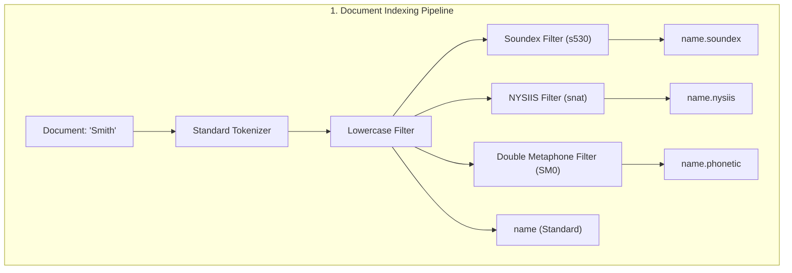
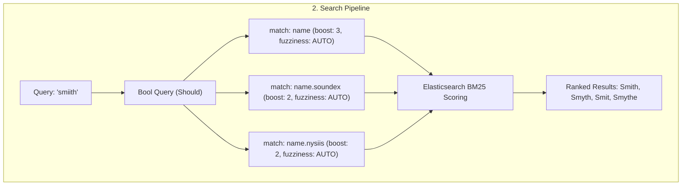

# Phonetic Search with Elasticsearch

A TypeScript and Node.js application demonstrating phonetic matching and fuzzy search using **Elasticsearch 9** and the `analysis-phonetic` plugin.

This project showcases how to index and query text phonetically so that variations, common misspellings, and names that sound alike (such as *Smith*, *Smyth*, *Smit*, and *Smythe*) are matched accurately when searching for terms like `"smiith"`.

---

## Features

- **Multi-Algorithm Phonetic Analysis**: Utilizes Elasticsearch's `analysis-phonetic` plugin with three distinct phonetic encoders:
  - **Soundex**: Classic phonetic algorithm encoding names by English consonant sounds.
  - **NYSIIS** (*New York State Identification and Intelligence System*): Pronunciation-preserving algorithm tailored for surnames.
  - **Double Metaphone**: Sophisticated phonetic algorithm supporting complex pronunciation rules and international names.
- **Multifield Index Mapping**: Indexing a single `name` property across multiple subfields (`name`, `name.phonetic`, `name.soundex`, `name.nysiis`), each with its own specialized analyzer.
- **Preserved Original Tokens (`replace: false`)**: Emits both the original terms and the phonetic encodings at the same position, preventing loss of exact-match precision.
- **Scored & Boosted Querying**: Executes a `bool` query with weighted `should` clauses and `fuzziness: "AUTO"` to prioritize exact matches while rewarding phonetic similarities.
- **Token Analysis Utility (`compare()`)**: Built-in helper function querying Elasticsearch's `_analyze` API to inspect and contrast tokens produced by different phonetic analyzers.
- **Declarative Docker Setup**: Docker Compose environment running Elasticsearch 9.1.0 with automated plugin provisioning via `elasticsearch-plugins.yml`.

---

## How It Works




### Analyzers & Field Mappings

The `users` index configures three custom analyzers using the `standard` tokenizer and the `lowercase` filter:

| Field | Analyzer | Encoder | Description |
| :--- | :--- | :--- | :--- |
| `name` | `standard` | *None* | Standard text field for exact/fuzzy token matching |
| `name.phonetic` | `name_analyzer` | `double_metaphone` | Handles subtle phonetic variations and multi-language rules |
| `name.soundex` | `soundex_analyzer` | `soundex` | Traditional English phonetic encoding |
| `name.nysiis` | `nysiis_analyzer` | `nysiis` | Better handling of vowels and surname phonetic structures |

> [!NOTE]
> All phonetic filters use `replace: false`. This ensures that Elasticsearch generates both the phonetic token and the original token, allowing search queries to match against either the sound or the original text.

---

## Project Structure

```text
phonetic-search/
├── config/
│   └── elasticsearch-plugins.yml  # Declarative plugin setup (analysis-phonetic)
├── dist/                          # Compiled JavaScript output
├── src/
│   ├── elastic-search.ts          # Elasticsearch client connection (http://localhost:9200)
│   ├── index.ts                   # Index management, seeding, phonetic search, and token analysis
│   └── utils/
│       └── users.ts               # Sample dataset (Smith variations, Prashant, Croosant)
├── docker-compose.yml             # Elasticsearch 9.1.0 container configuration
├── package.json                   # Dependencies and npm scripts
├── tsconfig.json                  # TypeScript configuration
└── README.md                      # Documentation
```

---

## Prerequisites

- [Node.js](https://nodejs.org/) (v18 or later recommended)
- [npm](https://www.npmjs.com/)
- [Docker](https://www.docker.com/) & [Docker Compose](https://docs.docker.com/compose/)

---

## Getting Started

### 1. Clone & Install Dependencies

```bash
git clone <repository-url>
cd phonetic-search
npm install
```

### 2. Start Elasticsearch

Launch the Elasticsearch container:

```bash
docker compose up -d
```

Check that Elasticsearch is running:

```bash
curl http://localhost:9200
```

> [!TIP]
> The container uses `config/elasticsearch-plugins.yml` to install and enable the `analysis-phonetic` plugin automatically upon startup.

### 3. Build the Project

Compile TypeScript to JavaScript in the `dist/` directory:

```bash
npm run build
```

*(or `npx tsc`)*

### 4. Run the Application

Execute the compiled script:

```bash
npm start
```

*(or `node dist/index.js`)*

---

## What Happens When You Run

When [`src/index.ts`](file:///home/pratik/Desktop/Comeback%20Arc/phonetic-search/src/index.ts) executes, it performs the following steps:

1. **Deletes existing index**: Cleans up any prior `users` index to ensure a fresh test environment.
2. **Creates `users` index**: Applies the custom phonetic token filters, custom analyzers, and multi-field mappings.
3. **Seeds mock data**: Inserts documents from [`src/utils/users.ts`](file:///home/pratik/Desktop/Comeback%20Arc/phonetic-search/src/utils/users.ts):
   ```typescript
   [
     "Smith",
     "Smyth",
     "Smit",
     "Smythe",
     "Prashant",
     "Croosant"
   ]
   ```
4. **Performs Phonetic Search**: Executes a search for `"smiith"`, matching all phonetic variations of "Smith" despite the deliberate typo.

---

## Usage Examples

### Inspecting Phonetic Tokens with `compare()`

The `compare` function in [`src/index.ts`](file:///home/pratik/Desktop/Comeback%20Arc/phonetic-search/src/index.ts) demonstrates how Elasticsearch converts different spellings into phonetic representations:

```typescript
await compare("Smith");
await compare("Smyth");
```

Output:
```json
{
  "name": "Smith",
  "soundex": ["s530"],
  "nysiis": ["snat"]
}
{
  "name": "Smyth",
  "soundex": ["s530"],
  "nysiis": ["snat"]
}
```

Because both `"Smith"` and `"Smyth"` resolve to the exact same Soundex code (`s530`) and NYSIIS code (`snat`), searches for either variant match both documents.

### Search Query Logic

```typescript
const search = async (name: string) => {
  const result = await es.search({
    index: "users",
    query: {
      bool: {
        should: [
          {
            match: {
              name: {
                query: name,
                boost: 3,
                fuzziness: "AUTO",
              },
            },
          },
          {
            match: {
              "name.soundex": {
                query: name,
                boost: 2,
                fuzziness: "AUTO",
              },
            },
          },
          {
            match: {
              "name.nysiis": {
                query: name,
                boost: 2,
                fuzziness: "AUTO",
              },
            },
          },
        ],
      },
    },
  });

  console.log(result.hits.hits);
};
```

---

## Troubleshooting

### Check Plugin Installation
To verify that the `analysis-phonetic` plugin is loaded inside your running container:

```bash
docker exec -it elasticsearch bin/elasticsearch-plugin list
```

Expected output:
```text
analysis-phonetic
```

### Check Cluster Health
```bash
curl http://localhost:9200/_cat/health?v
```

### Reset Index Manually
If you ever need to manually delete the index:

```bash
curl -X DELETE http://localhost:9200/users
```
